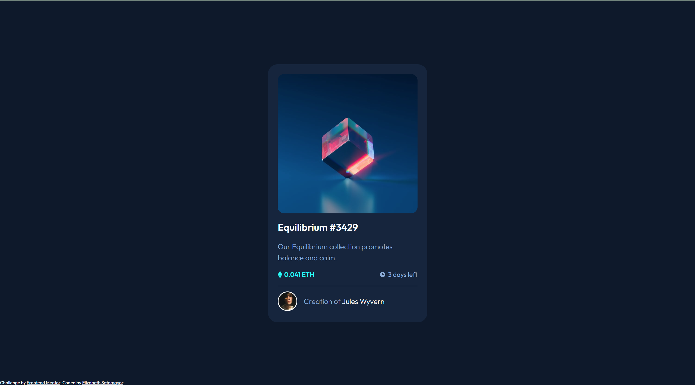

# Frontend Mentor - NFT preview card component solution

This is a solution to the [NFT preview card component challenge on Frontend Mentor](https://www.frontendmentor.io/challenges/nft-preview-card-component-SbdUL_w0U). Frontend Mentor challenges help you improve your coding skills by building realistic projects. 

## Table of contents

- [Overview](#overview)
  - [The challenge](#the-challenge)
  - [Screenshot](#screenshot)
  - [Links](#links)
- [My process](#my-process)
  - [Built with](#built-with)
  - [What I learned](#what-i-learned)
  - [Useful resources](#useful-resources)
- [Author](#author)
- [Acknowledgments](#acknowledgments)

## Overview

### The challenge

Users should be able to:

- View the optimal layout depending on their device's screen size
- See hover states for interactive elements

### Screenshot

### Links

- Solution URL: [Github](https://github.com/elizabethrsotomayor/nft-preview-card-component-main)
- Live Site URL: [Live site](https://elizabethrsotomayor.github.io/nft-preview-card-component-main)

## My process

### Built with

- Semantic HTML5 markup
- CSS custom properties
- Flexbox
- Mobile-first workflow

### What I learned

The `
` tag that was seen in the design mock up was a challenge for me to get right. I initially tried to set the color using `color` but it didn't work so I ended up setting the `background-color` to the color provided and got rid of the `border`. The padding used for the `
` made it disappear so I set it to a smaller value. There are a lot of flex containers that I used to get the icons/images to line up properly with the text. In addition, I tried to resize the main image for the card because it was too big. I tried several values/percentages but then found that it fit on its own once it was inside of a container. When I added the border to the avatar picture, it was square instead of round so I set a border-radius on it.

### Useful resources

- [Stack Overflow Changing the Color of an hr element](https://stackoverflow.com/questions/6382023/changing-the-color-of-an-hr-element) - I used this to create my hr element and it was helpful.
- [Stack Overflow Add border to circle image](https://stackoverflow.com/questions/16310985/add-border-to-circle-image)

## Author

- Website - [Elizabeth Sotomayor](https://elizabethrsotomayor.github.io/somyo2/)
- Frontend Mentor - [@elizabethrsotomayor](https://www.frontendmentor.io/profile/elizabethrsotomayor)
